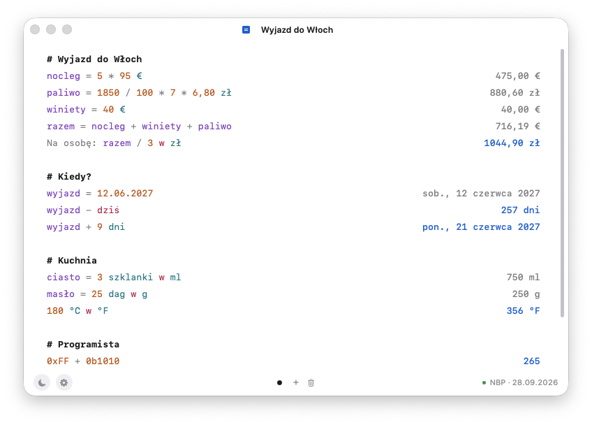
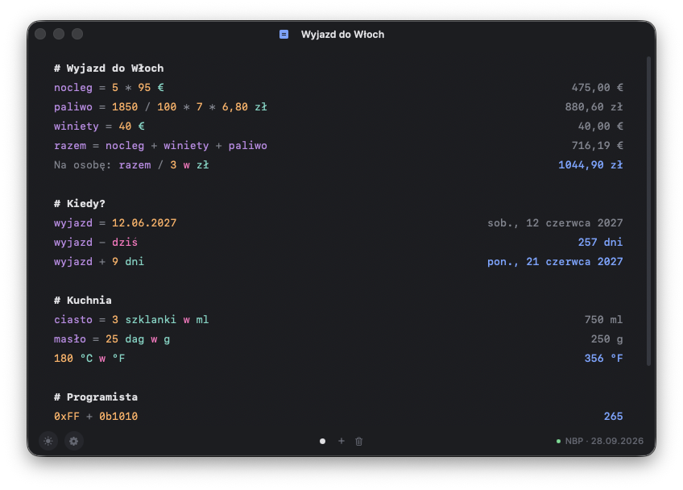

<p align="center">
  
</p>

<h1 align="center">Calcy</h1>

<p align="center">
  Kalkulator-notatnik na macOS. Piszesz obliczenia jak w notatkach, a wyniki pojawiają się obok – na bieżąco.<br>
  Zmienne, waluty po kursach NBP, daty, miary i wagi, tryb programisty. Po polsku i po angielsku.
</p>

<p align="center">
  
  
</p>

---

## Co potrafi

### Zmienne i zwykłe liczenie
```
nocleg = 5 * 95 €
razem = nocleg + 40 €
Na osobę: razem / 3 w zł          → 1042,57 zł
```
- Działania `+ - * / ^`, nawiasy, `mod`, ułamki z **kropką lub przecinkiem** (`3.5` i `3,5`).
- Zmiana wartości wyżej od razu przelicza wszystko niżej.
- `Etykieta: wyrażenie` – tekst przed dwukropkiem jest opisem.
- `// komentarz`, `# Nagłówek`.
- `suma` / `sum`, `średnia` / `avg` – z linii nad nimi (do pustej linii lub nagłówka), `poprzedni` / `prev` – poprzedni wynik.
- Funkcje: `sqrt`/`pierwiastek`, `round(x; 2)`, `min`, `max`, `abs`, `floor`, `ceil`, `sin`, `cos`, `tan`, `ln`, `log`, `pow`, `silnia` + stałe `pi`, `e`.
- Precyzyjne liczby dziesiętne – `0.1 + 0.2` to dokładnie `0,3`.

### Waluty (kursy NBP)
```
100 USD w PLN
50 € + 20 zł                       → wynik w euro
£10 jako euro
```
Kody (`USD`, `EUR`, `CHF`…), symbole (`$`, `€`, `£`, `zł`) i słowa (`dolarów`, `franków`). Średnie kursy z tabeli A NBP (32 waluty), odświeżane co 3 godziny i zapamiętywane – działają też bez internetu.

### Daty i czas
```
dziś + 7 dni
25.12.2026 - dziś                  → ile dni do świąt
teraz + 90 min
3 dni + 12 h                       → 3,5 dnia
```
`dziś`/`today`, `jutro`, `wczoraj`, `teraz`/`now`, daty `25.12.2026` i `2026-12-25`, jednostki od sekund do lat – z polską odmianą (1 dzień, 2 dni, 5 tygodni).

### Miary i wagi
```
180 cm na ft
2 kg + 50 dag                      → 2,5 kg
3 szklanki w ml                    → 750 ml
4,2 m * 3,5 m                      → 14,7 m²
100 °F na °C
```
Długość, waga (z `dag`!), objętość (z szklankami i łyżkami), powierzchnia, temperatura i rozmiary danych (`GB`, `GiB`…).

### Tryb programisty
```
0xFF + 0b1010                      → 265
1280 in hex                        → 0x500
0xF0 | 0x0F                        → 0xFF
1 << 10
```

### Wygoda
- **Karty** – osobne notatniki. Kropki na dole okna, przełączanie kliknięciem, gestem dwóch palców w bok albo ⌃Tab. Nazwę karty zmienisz, klikając ją na górze okna.
- **Tab** podpowiada nazwy zmiennych i funkcji – pasek na dole, przechodzenie Tabem lub strzałkami.
- **Kliknięcie wyniku** kopiuje go do schowka.
- **⌃⌥C** z dowolnego miejsca pokazuje i chowa Calcy.
- **Jasny i ciemny motyw** – przełącznik w lewym dolnym rogu.
- **Ustawienia (⌘, albo koło zębate w stopce)** – własne okno w stylu aplikacji:
  rozmiar tekstu z podglądem, uruchamianie przy logowaniu i ukrycie ikony w Docku.
  Po ukryciu Calcy pokazuje się w pasku menu (pokaż okno, ustawienia, zakończ).
- **Zawsze na wierzchu (⌃⌥T)** – okno zostaje nad oknami innych aplikacji; widać to po niebieskiej
  ramce i plakietce w nagłówku, którą można kliknąć, żeby wyłączyć.
- Ustawienia, motyw, rozmiar okna i ostatnio otwarta karta są zapamiętywane.
- Wszystko zapisuje się samo.

## Aktualizacje

Każdy commit na `main` uruchamia [GitHub Action](.github/workflows/release.yml), który buduje aplikację,
składa instalator i publikuje wydanie. Calcy sprawdza wydania raz na 6 godzin (można wyłączyć w ustawieniach)
i pokazuje pasek „Dostępna nowa wersja” z przyciskiem **Zaktualizuj** – aplikacja sama pobiera instalator,
podmienia się i uruchamia ponownie. Ta sama informacja jest w ikonie w pasku menu i w ustawieniach.

## Pobieranie i instalacja

**Wymagania:** macOS 15 lub nowszy.

1. Wejdź w **[Releases](../../releases/latest)** i pobierz `Calcy.dmg`.
2. Otwórz plik i przeciągnij **Calcy** do folderu **Aplikacje**.
3. Przy pierwszym uruchomieniu macOS pokaże ostrzeżenie, bo aplikacja nie jest podpisana płatnym certyfikatem Apple. Żeby ją otworzyć:
   - kliknij Calcy **prawym przyciskiem → Otwórz → Otwórz**, albo
   - wejdź w **Ustawienia systemowe → Prywatność i ochrona** i kliknij **Otwórz mimo to**.

   Wystarczy zrobić to raz. Alternatywnie w Terminalu:
   ```bash
   xattr -dr com.apple.quarantine /Applications/Calcy.app
   ```
4. Opcjonalnie: w menu **Calcy → Uruchamiaj przy logowaniu**, żeby skrót ⌃⌥C działał od razu po starcie Maca.

## Skróty klawiszowe

| Skrót | Działanie |
|---|---|
| ⌃⌥C | Pokaż / ukryj Calcy (z dowolnej aplikacji) |
| ⌃⌥T | Zawsze na wierzchu |
| ⌘, | Ustawienia |
| ⌘N | Nowa karta |
| ⌃Tab / ⌃⇧Tab | Następna / poprzednia karta |
| ⌘1 … ⌘9 | Konkretna karta |
| ⌘R | Zmień nazwę karty |
| ⇧⌘⌫ | Usuń kartę |
| Tab | Podpowiedzi nazw (Tab / ← → przechodzi, ↵ zatwierdza, esc anuluje) |
| ⌘Q | Zamknij Calcy (zamknięcie okna zostawia ją w tle) |

Skróty ⌃⌥C i ⌃⌥T działają globalnie, więc zadziałają też wtedy, gdy pracujesz w innej aplikacji.

## Gdzie są moje dane

Każda karta to zwykły plik tekstowy w `~/Library/Application Support/Calcy/karty/` (np. `002 Zakupy.txt`), obok leży `kursy.json` z ostatnimi kursami walut. Nic nie jest wysyłane do internetu poza pobieraniem kursów z [API NBP](https://api.nbp.pl).

## Budowanie z kodu

Potrzebne: macOS 15+ i Xcode (Swift 6; `actool` z Xcode kompiluje ikonę).

```bash
git clone https://github.com/adaTomaszewsk/calcy.git
cd calcy
./scripts/build-app.sh --install   # buduje Calcy.app i kopiuje do ~/Applications
swift test                         # testy silnika obliczeń
```

Ikona aplikacji: `Resources/Calcy-ico.icon` (Icon Composer) – kompiluje ją `actool` przy budowaniu.
Rysunek kota powstaje w `swift scripts/make-icon.swift` (m.in. `Resources/Calcy-kot.png` na przezroczystym tle).
Instalator: `./scripts/make-dmg.sh` buduje `build/Calcy.dmg` z własnym tłem (wymaga `brew install create-dmg`).

### Struktura

- `Sources/CalcEngine` – silnik obliczeń (lexer → parser Pratta → ewaluator), bez zależności od interfejsu.
- `Sources/Calcy` – aplikacja (SwiftUI + AppKit).
- `Tests/CalcEngineTests` – testy silnika.
